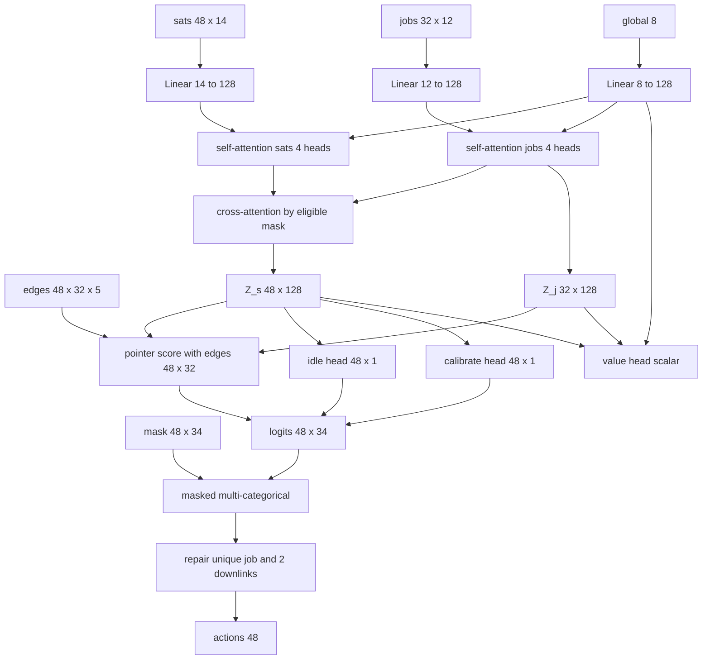

# HARMONY

**Hybrid Autonomous Resource Management for Orbital Networks**

RL-диспетчер ведёт смену спутниковой группировки: на каждом тике 5 минут он решает, что делает каждый аппарат — **ожидает**, **калибруется** или **выполняет задание** (ретрансляция или сброс на Землю). Решение принимается с учётом заряда, температуры, срока допуска, окон связи, затмений и внезапных сообщений оператора.

Три пакета: физика в [`sim/`](sim/), обучение и веса в [`agent/`](agent/), консоль оператора в [`web/`](web/). Пакет организаторов лежит в [`task/`](task/).

## Физика берётся у организаторов, а не пишется заново

[`sim/ops/resource_env.py`](sim/ops/resource_env.py) и [`sim/ops/operations.py`](sim/ops/operations.py) — это копии [`task/model/`](task/model/) **без единой правки формул**. Заряд, тепловая динамика, допуск команд и журнал смены считаются там. Любое переписывание этих формул означало бы, что журнал агента разъедется с оценкой кейса.

Что именно наследуется:

| Явление | Откуда берётся |
|---------|----------------|
| Заряд только на солнце | `solar_w[k]` в `Environment.transition`: в затмении `solar_w = 0`, баланс уходит в минус |
| Заряд ещё и в окне температур | `charge_min_c <= temp <= charge_max_c`, иначе прирост обнуляется |
| Нагреватель | включается при `temp < heater_below_c` и добавляет `heater_w` в нагрузку |
| Тепловая инерция | `equilibrium + (temp - equilibrium) * exp(-dt / thermal_tau_s)` |
| Срок допуска | `calibration_age_steps >= calibration_valid_steps` то задания закрыты до калибровки |
| Наземный ресурс | `downlink_parallel_limit = 2` — не более двух сбросов за тик на всю группировку |
| Резерв энергии | команда отклоняется, если SoC до или после шага ниже `reserve_soc_pct` |

Kepler и Basilisk остаются в `sim/`, но в `Session.advance` не вызываются: в описании данных сказано прямо, что координаты и станции не считаются, Солнце и доступность уже заданы рядами. Kepler рисует орбиты на глобусе консоли и не назначает задания; заряд и окна связи по-прежнему из JSON.

## Сценарии

| Файл | Состав | Роль |
|------|--------|------|
| [P01_intro.json](task/data/P01_intro.json) | 16 КА, 48 шагов, 18 заданий | дымовые тесты, отладка масок |
| [P02_shift.json](task/data/P02_shift.json) | 48 КА, 288 шагов, 1208 заданий | основное обучение и бейзлайн |
| [P03_energy.json](task/data/P03_energy.json) | 48 КА, дефицит энергии | оценка |
| [P04_demand.json](task/data/P04_demand.json) | 8120 заданий | поздний стресс-тест |

## Задача агента

Действие аппарата на тике: `idle`, `calibrate` или `job <id>`. Жёсткого `reject` нет.

**Задание живёт дольше одного тика.** `work_steps` до 3 шагов, прогресс хранится в самом задании (`remaining_steps`), привязки задания к аппарату в модели **нет**. Поэтому ретрансляцию можно прервать и продолжить другим допустимым аппаратом на следующем тике — прогресс сохраняется. `downlink` перебросить нельзя: у него ровно один допустимый исполнитель. Штрафа за переключение в модели нет, поэтому политика могла бы дёргать задание туда-сюда без пользы — против этого в рёбрах есть признак «был последним исполнителем», а в награде небольшой штраф за смену исполнителя.

**Внезапные сообщения** приходят перед действием текущего шага, ровно как в `Session.apply_event`:

| Событие | Что делает | Вероятность на тик при обучении |
|---------|------------|--------------------------------|
| `add_jobs` | в учебном шуме это пропуск: план и так известен, пул заданий не растёт. Сообщение оператора и `events_demo.json` по-прежнему добавляют задания | 0.12, считается как `events/skipped` |
| `satellite_outage` | 1–3 незанятых аппарата недоступны на 2–8 шагов | 0.05 |
| `close_downlink` | окна сброса закрыты на 2–6 шагов | 0.03 |

На оценке вместо случайного шума подаётся сценарий [events_demo.json](task/examples/events_demo.json) (`--events demo`) либо шум отключается (`--events none`).

## Две политики смены

Физика одна, начисление награды разное — задаётся флагом `--goal`:

- **Приоритетное обслуживание** (`priority`): крупно за закрытие задания приоритета 3 в срок, меньше за 2 и 1, мелкая добавка от `value_usd`, штраф за просроченный дедлайн по приоритету.
- **Коммерческая отдача** (`revenue`): начисляется `value_usd` в момент `completed_step`, приоритет 3 остаётся только в метриках `info`.

Общее для обеих и слабое по весу: падение ниже резерва, `brownout`, конфликтные команды, смена исполнителя без выигрыша, плюс небольшое поощрение за каждый отработанный шаг задания (иначе награда слишком разрежена).

## Архитектура агента

### Почему один проход сети на тик, а не по вызову на аппарат

Наивная схема опрашивает сеть отдельно для каждого КА. На P02 это 48 x 288 = **13 824 прохода за эпизод**, и столько же таймстепов PPO. Здесь энкодер за один проход выдаёт матрицу оценок `N x (K + 2)` сразу на всю группировку: **288 проходов за эпизод**, примерно в 48 раз меньше. Один таймстеп PPO = один тик, действие факторизовано по аппаратам (`MultiDiscrete`). Тот же аргумент относится к веб-сервису: пересчёт смены не должен упираться в 48 последовательных вызовов.

### Вход: Dict-наблюдение одного тика

`N_max = 48` (padding до максимума кейса), `K = 32` кандидатов-заданий, `d = 128`.

| Тензор | Форма | Содержание |
|--------|-------|------------|
| `sats` | `48 x 14` | SoC, запас над резервом, температура, возраст калибровки, остаток срока допуска, доступность, окно `downlink` сейчас, окно `relay` сейчас, `solar_w` сейчас, шагов до тени, шагов до солнца, ёмкость, флаг нагревателя, прогноз баланса мощности |
| `jobs` | `32 x 13` | приоритет onehot(3), `value_usd`, доля выполненного, остаток шагов, slack (`deadline - step - remaining`), близость дедлайна, тип onehot(2), доля допустимых КА, флаг «велась на прошлом шаге», шагов до `release` (0, если окно уже открыто) |
| `plan` | `8192 x 13` | тот же набор признаков на все незавершённые задания сценария, включая ещё не открытые. В действие не входит: эмбеддинг общий со слотами, дальше только пул в глобальный вектор |
| `edges` | `48 x 32 x 5` | допустим по списку, допустим сейчас по `can_execute`, хватает энергии, есть контакт нужного типа, был последним исполнителем |
| `global` | `8` | шаг/всего, доля открытых заданий, доля открытых приоритета 3, спрос на downlink-слоты, средний и минимальный SoC, цель onehot(2) |
| `mask` | `48 x 34` | валидные действия, уходит в распределение |

Кандидаты слотов действия — top-K известного списка: сначала исполнимые сейчас, среди остальных relay раньше downlink без окна. У будущих маска выключена, признаки видны. Назначить задание до окна нельзя. Полный список лежит в `plan` (до 8192). `K = 32` — ширина головы действий, не правило кейса. На P02 все исполнимые сейчас задания уже входят в 32 (открыто в среднем 19, с контактом около 7); `--top-k` не добавляет валидных классов.

Строки сверх числа реальных КА остаются **ровно нулевыми**. Нулевая ёмкость — то, по чему политика отличает padding от аппарата: `validate()` организаторов требует `capacity_wh > 0` у каждого КА, так что признак однозначен и 15-й столбец не нужен. Инвариант закреплён тестом `test_env_zero_fills_padding_rows`.

### Слои

| № | Слой | Вход | Выход |
|---|------|------|-------|
| 1 | `Linear(14 -> 128)` + LayerNorm + ReLU | `sats 48 x 14` | `H_s 48 x 128` |
| 1 | `Linear(13 -> 128)` + LayerNorm + ReLU | `jobs 32 x 13` и `plan 8192 x 13` | `H_j 32 x 128`, пул плана добавляется к `h_g` |
| 1 | `Linear(8 -> 128)` + LayerNorm + ReLU | `global 8` | `h_g 128`, добавляется бродкастом в `H_s` и `H_j` |
| 2 | self-attention по спутникам, 4 головы, pre-LN, residual, FFN `128 -> 512 -> 128` | `H_s` | `H_s` |
| 3 | self-attention по заданиям, та же структура | `H_j` | `H_j` |
| 4 | cross-attention `Q=H_s, K=V=H_j` по маске eligible | `H_s`, `H_j` | `Z_s 48 x 128` |
| 4 | cross-attention `Q=H_j, K=V=H_s` по той же маске | `H_j`, `H_s` | `Z_j 32 x 128` |
| — | блоки 2–4 повторяются 2 раза | | |
| 5 | pointer `v^T tanh(W_q Z_s[i] + W_k Z_j[j] + W_e edges[i,j])`, `d_pointer = 64` | `Z_s`, `Z_j`, `edges` | `scores 48 x 32` |
| 6 | головы `idle` и `calibrate`, `Linear(128 -> 1)` каждая | `Z_s` | `48 x 1` и `48 x 1` |
| 7 | конкатенация и маскирование `-inf`, `MaskableMultiCategoricalDistribution` | `logits 48 x 34` | действие: 48 индексов |
| 8 | repair-слой вне сети, без градиента | действие | исполнимые команды |
| 9 | критик: attention-pooling `Z_s` и `Z_j`, конкатенация с `h_g`, MLP `384 -> 128 -> 1` | `Z_s`, `Z_j`, `h_g` | `V`, один скаляр на тик |

Параметров в конфигурации по умолчанию: **1 659 397**.



### Почему именно такие слои

**Почему attention, а не плоский MLP.** В плоской сети число аппаратов зашито в размер входа — так сделано в прежней [`agent/policy/pointer_policy.py`](agent/policy/pointer_policy.py), и модель под 48 КА там нельзя запустить на 16. Внимание с padding-масками от `N` не зависит: те же веса обучаются на P02 (48 КА) и играют на P01 (16 КА) без переобучения. Проверяется тестом `test_one_model_runs_on_48_and_16_satellites`.

**Почему self-attention по спутникам.** Без него аппараты выбирают задания независимо и дерутся за одно и то же задание и за два downlink-слота. Здесь КА видят друг друга — это и есть основа координации; repair потом только подчищает остаток.

**Почему self-attention по заданиям.** Задания конкурируют за дедлайны и за наземный ресурс. «Приоритет 3» имеет смысл только относительно остальной очереди: если таких заданий в очереди тридцать, это совсем другая ситуация, чем если одно.

**Почему cross-attention по маске eligible.** Аппарат должен смотреть только на свои допустимые задания. Без маски внимание размывалось бы по всей очереди, а на P04 это 8120 записей. Кросс-внимание двустороннее: задания тоже должны видеть своих возможных исполнителей, иначе `Z_j` не знает, есть ли у задания шанс.

**Почему рёбра отдельным тензором `48 x 32 x 5`.** Eligibility — двудольное отношение, а «был последним исполнителем» и «хватает энергии на эту работу» — свойства пары. Признаками одного аппарата или одного задания это не выражается.

**Почему pointer-скоринг, а не `Linear` на фиксированное число заданий.** Состав очереди меняется каждый тик, а pointer сравнивает пары и работает при любом `K`. Аддитивная форма `v^T tanh(...)` выбрана, чтобы в оценку пары входили рёбра: скалярное произведение их не пустит.

**Почему `idle` и `calibrate` отдельными головами.** Это действия аппарата, а не выбор задания: job-эмбеддинга у них нет, и сравнивать их с заданиями через pointer было бы некорректно.

**Почему repair вне сети.** Жёсткие ограничения дешевле починить детерминированно, чем выучивать. Это совпадает с поведением `Environment.step`, который сам гасит `duplicate_job_in_step` и `ground_capacity` в `idle`, но чинится **до** отправки, чтобы в журнал смены не попадали заведомо отклонённые команды. Тайбрейк при конфликте: продолжение прежнего исполнителя, затем запас энергии, затем номер аппарата; при переполнении downlink-слотов остаются задания с более высоким приоритетом, близким дедлайном и большей стоимостью. Дальше repair может снять relay с единственного исполнителя незанятого сброса и отдать погашенному дублем или третьим сбросом КА свободный контактный relay. Добровольный idle и калибровку не трогает. Инварианты закреплены тестами `test_third_downlink_in_a_tick_becomes_idle`, `test_third_downlink_with_relay_is_reassigned`, `test_unique_downlink_preempts_relay` и `test_unique_job_per_step_and_downlink_cap`.

**Почему один критик на тик.** Награда начисляется за шаг мира целиком: у отдельного аппарата своей награды нет, и раздавать её по аппаратам значило бы придумывать разбиение, которого в модели кейса не существует.

**Почему физика из `Environment`, а не из Kepler.** `solar_w` и окна связи заданы рядами, журнал сверяется с моделью организаторов. Подставить Kepler-орбиты в заряд означало бы разъехаться с оценкой.

### Замечания по скорости

Вырожденные строки (аппарат без допустимых заданий, пустая очередь) обрабатываются явно: такой строке открывается первый ключ, а выход внимания гасится множителем, так что в residual остаётся исходное состояние. Иначе softmax по пустому множеству ключей даёт NaN.

Внимание считается через `F.scaled_dot_product_attention` со слитой проекцией QKV и маской формы `(B, 1, L, S)`, которая транслируется по головам внутри ядра. У `nn.MultiheadAttention` маску приходится раздувать до `B * heads x L x S`, и на длинном rollout это лишняя работа и лишняя память. Самый крупный тензор прохода — `B x 48 x 32 x d_pointer` в pointer-слое; `tanh` там применяется на месте.

Профиль сети задаётся флагом `--profile`: `full` (по умолчанию) — размеры из таблицы выше, `light` (`d = 64`, один блок, FFN 128) — для дымовых прогонов на слабом CPU. Для обучения на CPU полезно ограничить потоки: `set OMP_NUM_THREADS=<ядра>`.

## Установка

Python 3.10+. На Windows: `py -3`.

```bash
cd HARMONY
py -3 -m pip install -r requirements.txt
```

## Использование

### Обучение

```bash
py -3 -m agent.train --scenario p02 --goal priority --timesteps 200000
py -3 -m agent.train --scenario p02 --goal revenue  --timesteps 200000
py -3 -m agent.train --scenario p01 --goal priority --timesteps 5000 --profile light   # дымовой прогон
```

Модель: `agent/models/ops_<goal>.zip`. Полезные флаги: `--n-envs`, `--subproc`, `--top-k`, `--max-steps`, `--no-events`, `--tensorboard`, `--seed`, `--load`, `--resume`, `--run-dir`.

Короткие прогоны на этой машине (`P01`, 4800 таймстепов) в `agent/runs/` и `agent/figures/` — только проверка контура. Награда растёт, но политика не обгоняет greedy: слишком мало шагов, и сеть перекашивается в калибровку. Рабочее обучение — `P02` на отдельном CPU, команда выше.

### Логи и графики

Каждый запуск заводит `agent/runs/<дата-время>_<сценарий>_<goal>/`:

| Файл | Что внутри |
|------|------------|
| `train.log` | человекочитаемый поток SB3, то же, что в stdout |
| `progress.csv` | машинный ряд, из него строятся графики |
| `config.json` | гиперпараметры, seed, сценарий, `goal`, `K`, `N_max`, вероятности событий, число параметров |
| `tb/` | tensorboard, при `--tensorboard` |
| `plots/` | PNG после `agent.plots` и каждые 20 минут обучения |
| `checkpoints/` | веса `ckpt_<step>.zip` каждые 20 минут |

Помимо стоковых `rollout/ep_rew_mean` и `train/*`, `OpsMetricsCallback` пишет доменные метрики из `Session.summary()`: `ops/jobs_completed`, `ops/jobs_due_missed`, `ops/critical_done_on_time`, `ops/critical_due`, `ops/revenue_usd`, `ops/below_reserve_steps`, `ops/brownout_steps`, `ops/min_soc_pct`, `ops/blocked_commands`, `act/idle_share`, `act/calibrate_share`, `act/job_share`, `act/conflicts_repaired`, `act/downlink_slots_used`, `act/executor_switches`, `events/add_jobs`, `events/outage`, `events/close_downlink`, `events/skipped`.

```bash
py -3 -m agent.plots --run agent/runs/<run>
py -3 -m agent.plots --run agent/runs/<run_priority> --run agent/runs/<run_revenue>   # сравнение политик
```

Графики копируются в [`agent/figures/`](agent/figures/): кривая обучения, приоритет 3 в срок вместе с просрочкой, выручка, минимальный SoC вместе с `below_reserve` и `brownout`, стек долей действий.

### Оценка и журнал смены

```bash
py -3 -m agent.evaluate --scenario p02 --policy greedy --events demo
py -3 -m agent.evaluate --scenario p02 --policy ppo --model agent/models/ops_priority.zip --journal agent/runs/eval
py -3 -m agent.evaluate --scenario p03 --policy ppo --model agent/models/ops_priority.zip
py -3 -m agent.baseline --scenario p02 --goal priority
```

`--journal` пишет `journal_<episode>.json` в схеме `cosmo-B-ops-result-1.0`: `commands`, `events`, `trace`, `summary`. Это тот журнал, которым по критериям кейса подтверждаются выводы о простоях и потерях; целостность проверяется сразу — `replay_episode` из библиотеки организаторов должен воспроизвести ту же сводку, иначе запись падает с ошибкой.

PPO при оценке **сэмплирует**, как при обучении (`--deterministic` включает argmax). Argmax по 48 категориальным почти всегда выбирает ожидание: idle — один класс, задания размазаны по K слотам.

Жадный бейзлайн в [`agent/greedy.py`](agent/greedy.py) читает то же наблюдение, что и сеть: берёт допустимое задание с максимумом по (приоритет, стоимость на шаг, дедлайн), иначе калибрует аппарат при подходящем к концу сроке допуска, иначе ждёт.

Ход решений по прогонам — в [`agent/runs/PROTOCOL.md`](agent/runs/PROTOCOL.md).

### Консоль оператора

[`web/`](web/) показывает загруженную смену. Глобус — картинка Kepler, не физика заряда и не назначение заданий. Агент консоль не вызывает. Что видит оператор (цвета, таймлайн, 3D, графики) — [`web/INTERFACE.md`](web/INTERFACE.md).

```bash
docker compose -f web/docker-compose.yml up --build
```

Nginx отдаёт UI на порту 80, FastAPI держит один сценарий в памяти и отдаёт орбиты.

### Тесты

```bash
py -3 -m pytest -q
```

Проверяется, помимо прочего: заряд только при `solar_w > 0` и в окне температур, нагреватель ниже порога, истёкший допуск закрывает задания и снимается калибровкой, третий downlink в тике превращается в ожидание (или в свободный relay, если он есть), одно задание — один исполнитель за тик, уникальный сброс забирает КА у relay, relay-handoff сохраняет прогресс, `add_jobs` виден на том же шаге, интервал недоступности истекает, случайные события проходят `validate()` организаторов, две политики по-разному оценивают один и тот же прогон, одна и та же сеть отрабатывает 48 и 16 КА.

## Структура

```
task/                         пакет организаторов: сценарии, модель, критерии
sim/ops/                      копии модели без правок формул + пути к task/
sim/                          Kepler (глобус консоли), Basilisk, coverage, condition
agent/env/ops_env.py          Gym-среда на Session: Dict-obs, MultiDiscrete, repair, события
agent/policy/ops_policy.py    attention-политика и критик
agent/greedy.py               жадный бейзлайн
agent/train.py                обучение MaskablePPO
agent/evaluate.py             оценка и журнал смены
agent/baseline.py             greedy / random / PPO в одной таблице
agent/telemetry.py            каталог запуска, логгер, доменные метрики
agent/plots.py                PNG из progress.csv
agent/legacy_kepler.py        прежний контур attach/defer, вне обучения
agent/models/                 веса .zip
agent/runs/                   логи обучения (в git не идут); PROTOCOL.md — журнал решений
agent/figures/                графики и сводки
web/                          консоль: nginx + FastAPI, Kepler-орбиты, агент не вызывается
web/INTERFACE.md              каталог UI: как пульт доносит состояние смены
web/openapi.yaml              HTTP-контракт пульта
```

Прежний Kepler-контур (`agent/env/task_assignment_env.py`, `agent/policy/pointer_policy.py`, `agent/legacy_kepler.py`, `agent/demo_basilisk.py`) учебным больше не является и оставлен как проверка Basilisk-бэкенда.
